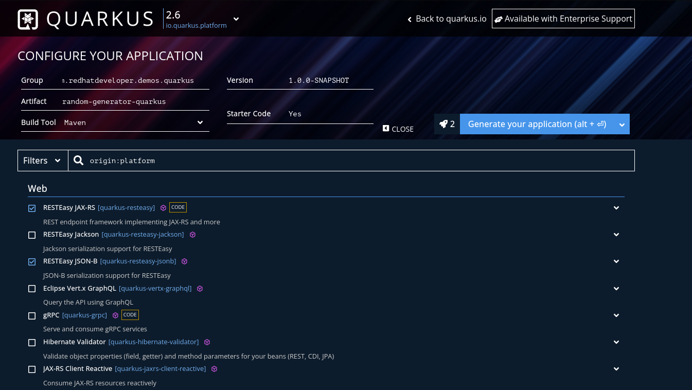
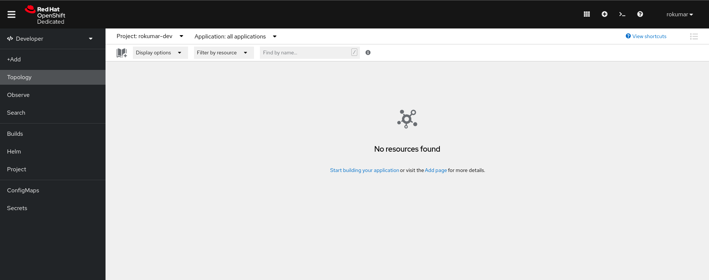
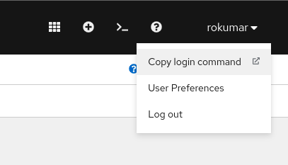
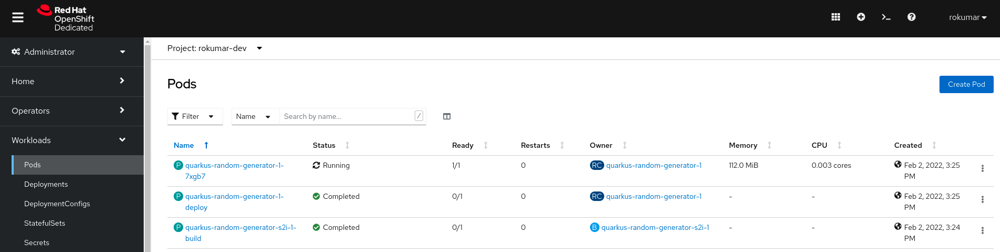
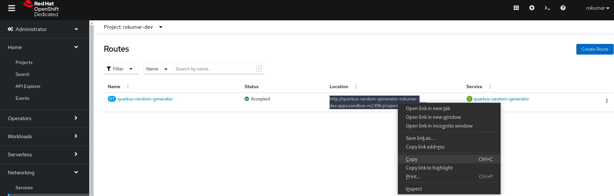

# Deploying a Java Maven project on Red Hat OpenShift in seconds

[](https://github.com/eclipse/jkube)

This is a demo repository used in one of Red Hat Developer Sandbox Activity: [Package and run your Java Maven application on OpenShift in seconds](https://developers.redhat.com/articles/2022/03/01/package-and-run-your-java-maven-application-openshift-seconds#generate_a_simple_java_application)

## Contents
- [Prerequisites](#prerequisites)
- [Preparing Application](#preparing-application)
- [How to Build?](#how-to-build)
- [How to Run Locally?](#how-to-run-locally)
- [Provision your free Red Hat OpenShift Development Cluster:](#provision-your-free-red-hat-openshift-development-cluster)
- [Deploying Java Maven application to Red Hat OpenShift:](#deploying-java-maven-application-to-red-hat-openshift)
- [Cleanup](#cleanup)


## Prerequisites
You’d need the following things in order to do this activity:
- Red Hat OpenShift Developer Sandbox Account 
- [oc - OpenShift Command Line Interface CLI (optional)](https://developers.redhat.com/blog/2021/04/21/access-your-developer-sandbox-for-red-hat-openshift-from-the-command-line#first_stop__the_openshift_dashboard)
- [Java Development Kit](https://adoptopenjdk.net/)
- A text editor

## Preparing Application
This project is generated from [code.quarkus.io](https://code.quarkus.io/). We basically select required dependencies for a typical REST microservice from web interface:



On top of that, We've added a simple REST endpoint `/random` to generate a random response. You can checkout code for more details.

## How to Build?
```shell
$ ./mvnw clean install
```

## How to Run Locally?
```shell
$  java -jar target/quarkus-app/quarkus-run.jar
```
In another terminal, do a CURL to this URL:

```shell
$ curl localhost:8080/random
{"id":"91d9bd52-232f-4807-a93a-5f38f8727167"}
```

## Provision your free Red Hat OpenShift Development Cluster
[Red Hat OpenShift Developer Sandbox](https://developers.redhat.com/developer-sandbox) is a free OpenShift cluster that gives you the experience of working with an actual Kubernetes Cluster and learning more about it. Unlike other cloud platforms, it doesn’t require any credit card (since it’s targeted towards Developers) . You just need to create a [Red Hat Account](https://sso.redhat.com/auth/realms/redhat-external/login-actions/registration?client_id=rhd-web&tab_id=lsjXrypZMMk) and use that to provision your OpenShift Cluster.

Once you’ve created an account and logged into your OpenShift cluster. It should look like this:



You can also connect to this OpenShift Cluster from your terminal. This would require oc CLI binary to be installed on your machine. You can read more about this in this blog post here:

[Access your Developer Sandbox for Red Hat OpenShift from the command line](https://developers.redhat.com/blog/2021/04/21/access-your-developer-sandbox-for-red-hat-openshift-from-the-command-line#)

To authenticate your laptop to the cluster, `oc login` is used but it is not mandatory. We can also specify OpenShift Developer Sandbox Cluster configuration via properties.



After clicking on the copy login command option, use Devsandbox user and click Display Token. Copy command and paste it in your terminal:

```shell
$ oc login --token=sha256~%TOKEN% --server=https://%SERVER%:6443
Logged into "https://%SERVER%:6443" as "%USERNAME%" using the token provided.

You have access to the following projects and can switch between them with 'oc project <projectname>':

  * %USERNAME%-dev
    %USERNAME%-stage

Using project "%USERNAME-dev".
Welcome! See 'oc help' to get started.
```

## Deploying Java Maven application to Red Hat OpenShift:
We’d be using [Eclipse JKube](https://github.com/eclipse/jkube) to package and deploy this application to Red Hat OpenShift. Since we’re using the maven project we’ll use the [OpenShift Maven Plugin](https://www.eclipse.org/jkube/docs/openshift-maven-plugin). If you’re a Gradle user, you can also use the [OpenShift Gradle Plugin](https://www.eclipse.org/jkube/docs/openshift-gradle-plugin). You can find more information about Eclipse JKube in the following articles:

- [Java development on top of Kubernetes using Eclipse JKube](https://developers.redhat.com/blog/2020/08/24/java-development-on-top-of-kubernetes-using-eclipse-jkube)
- [Introduction to Eclipse JKube: Java tooling for Kubernetes and Red Hat OpenShift](https://developers.redhat.com/blog/2020/01/28/introduction-to-eclipse-jkube-java-tooling-for-kubernetes-and-red-hat-openshift?source=sso)
- [Get started with Eclipse JKube Kubernetes/OpenShift Gradle Plugins ](https://developers.redhat.com/articles/2021/12/09/get-started-gradle-plugins-eclipse-jkube)

OpenShift Maven Plugin is already added in `openshift` profile in this project. You can go ahead and use Eclipse JKube OpenShift Maven Plugin goals to build a container image, generate YAML manifests, and apply them to the OpenShift cluster.

```shell
$ ./mvnw oc:build oc:resource oc:apply -Popenshift
```

These OpenShift Maven Plugin goals will do the following things:
- [oc:build](https://www.eclipse.org/jkube/docs/openshift-maven-plugin#jkube:build) : Creates a container image for your Java Maven application using Source to Image (S2I) build strategy. Image is built in a pod and pushed to OpenShift’s internal container registry.
- [oc:resource](https://www.eclipse.org/jkube/docs/openshift-maven-plugin#jkube:resource) : Generates opinionated YAML manifests (e.g. DeploymentConfig, Service, Route etc) for your Java Maven application. You can view them in the `target/classes/META-INF/jkube/openshift` directory.
- [oc:apply](https://www.eclipse.org/jkube/docs/openshift-maven-plugin#jkube:apply) : Applies these generated YAML manifests to the connected OpenShift Cluster. You can think of this as the equivalent of `oc apply` / `kubectl apply`


Once the application is deployed you can check whether its pods got created in the OpenShift Developer Sandbox web console. In `Administrator` view, Go to `Workloads` > `Pods`; you should see something like this.



Once your application pods are in `Running` state, you can access your application via Route URL from OpenShift web console. In `Administrator` view, Go to `Networking` > `Routes` . You should see something like this:



You can copy URL from console and then access it via browser or via `curl`:
```shell
$ curl quarkus-random-quarkus-random-generator-rokumar-dev.apps.sandbox-m2.ll9k.p1.openshiftapps.com/random
{"id":"1660ad27-9fad-4b26-8cd1-3fa3193d962a"}
```

and that’s it! You’ve successfully deployed a Java Maven Application to a Red Hat OpenShift Cluster.

## Cleanup
Once you’ve done testing it. You can undeploy your application using openshift-maven-plugin’s undeploy goal:
```shell
$ ./mvnw oc:undeploy -Popenshift
```
